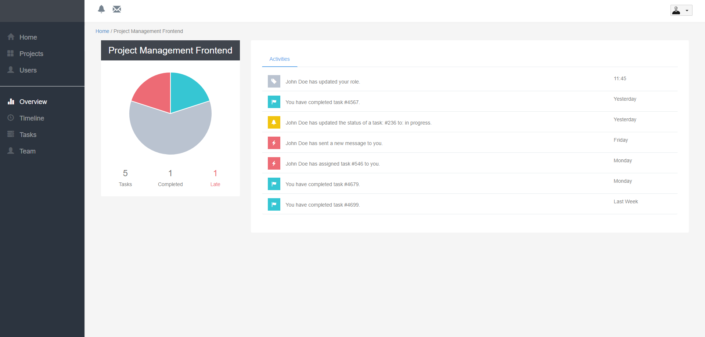
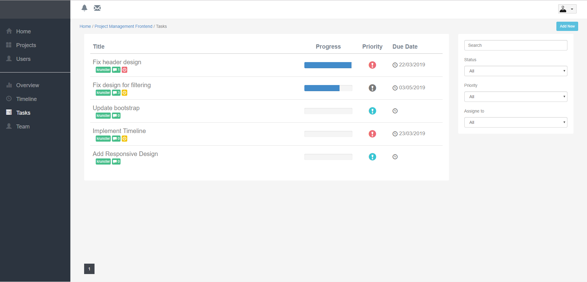
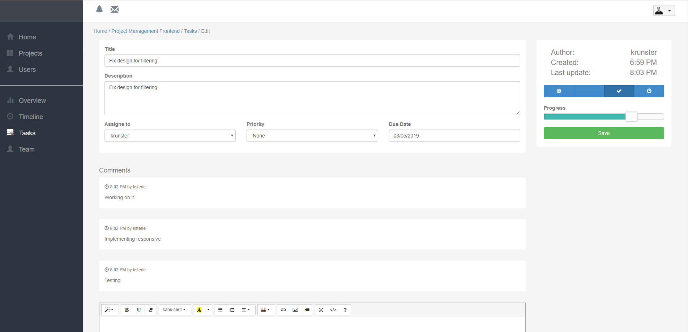

# Project Management Software as a Service Application

I have created this application as a part of my learning process of some advanced topics in architecture, multi-tenant applications, etc.    

The application consists of a landing page where User can log in to an existing account or register a new Company (the main tenant of the Application is the Company entity). A user who registers a Company is Administrator, and that User can invite new Users to the Company. Each Company can have n number of Projects and each Project can have n number of Tasks.    

## Built With
* ASP.NET MVC (.NET Framework 4.5.2)
* Entity Framework
* ASP.NET Identity
* Ninject
* [AutoMapper](https://github.com/AutoMapper/AutoMapper)
* [DynamicExpressionHandler](https://github.com/krunoslavsterle/DynamicExpressionHandler)
* [Elmah](https://github.com/elmah/Elmah)
* [Glimpse](https://github.com/Glimpse/Glimpse)
* [GravatarHelper](https://github.com/jkommer/GravatarHelper/)
* [PagedList](https://github.com/TroyGoode/PagedList)
* Bootstrap 3.2.0
* JQuery 1.8.0
* [iziToast](https://github.com/marcelodolza/iziToast)
* [Chart.js](https://www.chartjs.org/)
* [noUISlider](https://refreshless.com/nouislider/)
* [datepicker](https://github.com/fengyuanchen/datepicker)
* [moment.js](https://github.com/moment/moment)
* [summernote](https://github.com/summernote/summernote)

## Architecture
For this project, I have used the [Onion Architecture](https://jeffreypalermo.com/2008/07/the-onion-architecture-part-1/) which is a multi-layered architecture that heavily relies on the Dependency Inversion Principle.

#### Solution 'ProjectManagement'
* PM.Common
* PM.DAL
* PM.Model
* PM.Model.Common
* PM.Repository
* PM.Repository.Common
* PM.Service
* PM.Service.Common
* PM.Web

## Setup project
* create a new database and execute a 'CreateDatabase.sql' that is located in the /Database/CreateScripts
* update the connection string in web.config (PMDatabaseEntities) to point to the database you created
* build
* run 

## Notes
* This project is not finished. Majority of the features are implemented but not all (landing page, timeline, messages, and a few others)
* As landing page is not implemented, to open the Dashboard after the login you need to manually input the URL: '/Administration/Dashboard'
